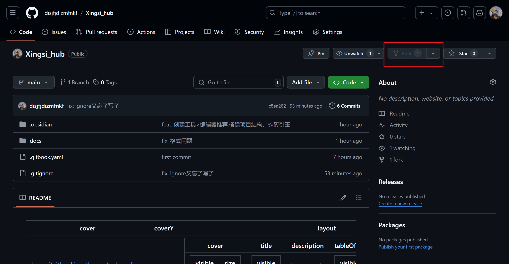
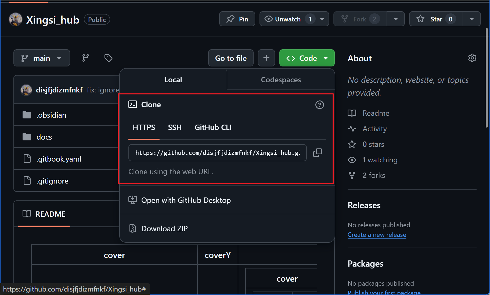

## 众人拾柴火焰高, 强烈建议您成为编辑者!!🚀

## 方法一:

&emsp;&emsp;在你本地编辑完成后将文档(最好是.md文档)上传到群文件中✨

实在不行用word,txt写好上传也可以 😭


## 方法二: 

##### [项目地址](https://github.com/disjfjdizmfnkf/Xinsi_hub)

1. 点击项目地址, fork这个项目

{loading=lazy}
<center>fork</center>

&emsp;&emsp;之后你就会看到你的仓库中也有这个项目了

2. **点入自己账号下面的仓库，clone至本地（注意是从你自己仓库中clone）**

> 啰嗦一下

&emsp;&emsp;记得要进入自己的仓库中，不要克隆
{loading=lazy}
<center>进入自己的仓库</center>

&emsp;&emsp;使用一种方式clone就行了
{loading=lazy}
<center>clone</center>


3. **施展你的才华！** 

> &emsp;&emsp;请先看 SUMMARY.md 文件, 文件中可以看到整个book的结构，之后根据项目结构, ***在 doc目录下的合适位置写下你的md文档***, ./docs/.gitbook/assets 下是用来放图片之类的东西的 `为了整个项目结构看起来整洁😚`

4. **git push 你的改动同步到个人仓库**

&emsp;&emsp;这是一个基本的git技能，不再赘述。
常用流程
- git pull
- git add .
- git commit -m "简单描述你添加了哪些内容“
- git push

5. **回到个人仓库提交pr即可，记得在pr中写一下你做了哪些修改, 等其他人merge后网页就会更新啦!**


## 注：

## 项目文件布局

```
mkdocs.yml    		# 配置文件，所有网站配置都在这里
docs/
	mkdocs/
		overrides/	# 覆盖 mkdocs 网站的底层样式
		css/		# 放置额外的 css 文件
		js/			# 放置额外的 js 文件
    index.md		# 文档 Home 主页面
	.meta.yml		# 文件元数据设置
    img/            # 图片，注意分类保持项目整洁
	...       		# 其他 markdown 页面，图片和其他文件
```

## Mkdocs 常用命令

* `mkdocs serve`：启动实时加载的文档服务器

* `mkdocs build`：创建文档站点

* `mkdocs -h`：打印帮助信息并退出